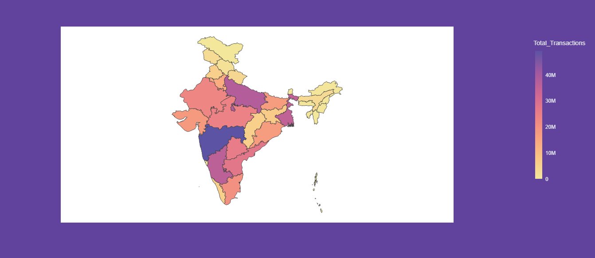
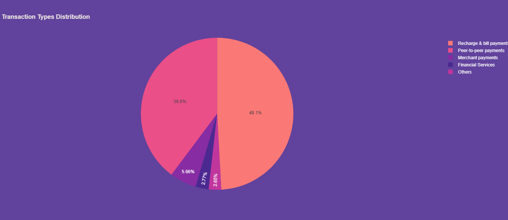
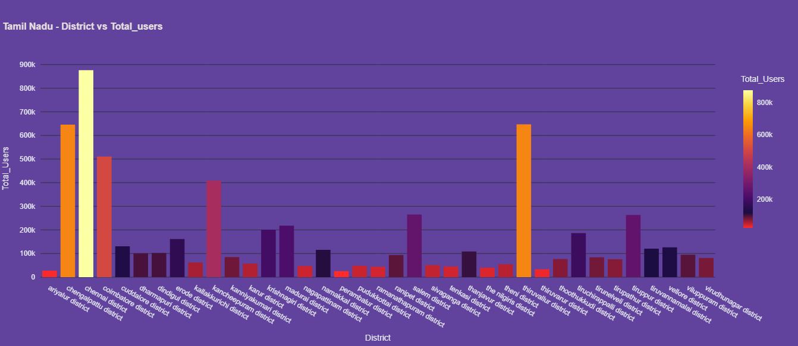

# Phonepe-Pulse-Data-Visualization-and-Exploration
Phonepe Pulse Data Visualization and Exploration: A User-Friendly Tool Using Streamlit and Plotly

# What is PhonePe Pulse?
    
The [PhonePe Pulse website](https://www.phonepe.com/pulse/explore/transaction/2022/4/) displays over 2000 crore transactions by users on an interactive map of India. PhonePe's statistics, which accounts for more than 45% of the market, reflects the country's digital payment habits.

The insights on the website and in the study were derived from two primary sources: the entirety of PhonePe's transaction data and merchant and customer interviews. The report is available for free download on the [PhonePe Pulse website](https://www.phonepe.com/pulse/explore/transaction/2022/4/) and [GitHub](https://github.com/PhonePe/pulse).

# Libraries/Modules needed for the project!

 1. [Plotly](https://plotly.com/python/) - (To plot and visualize the data)
 2. [Pandas](https://pandas.pydata.org/docs/) - (To Create a DataFrame with the scraped data)
 3. mysql.connector - (To store and retrieve the data)
 4. [Streamlit](https://docs.streamlit.io/library/api-reference) - (To Create Graphical user Interface)
 5. json - (To load the json files)
 6. git.repo.base - (To clone the GitHub repository)
 7. # Workflow

### Step 1: **Importing the Libraries:**
 
 
   Importing the libraries. I've already mentioned the list of libraries/modules required for the project. 
   First, we need to import all of those libraries. 

        !pip install ["Name of the library"]
    
   If the libraries are already installed then we have to import those into our script by mentioning the below codes.

        import pandas as pd
        import psycopg2
        import streamlit as st
        import plotly.express as px
        import os
        import json
        from streamlit_option_menu import option_menu
        from PIL import Image
        from git.repo.base import Repo
 
### Step 2:**Data extraction:** 
 

  Clone Github and use scripting to retrieve data from the Phonepe pulse Github repository and store it in a suitable format, such as JSON. To clone the phonepe github repository to your local drive, use the following syntax.
    
        from git.repo.base import Repo
        Repo.clone_from("GitHub Clone URL","Path to get the cloded files")
      
       
 ### Step 3: **Data transformation:**
 
 
   In this phase, the JSON files in the folders are converted into readable and understandable DataFrame format using a for loop and iterating file by file, and the DataFrame is then created. For this stage, I used the **os**, **json**, and **pandas** packages. Finally, the dataframe was converted into a CSV file and stored on the local storage.
   
   
    path1 = "Path of the JSON files"
    agg_trans_list = os.listdir(path1)

    # Give any column names that you want
    columns1 = {'State': [], 'Year': [], 'Quarter': [], 'Transaction_type': [], 'Transaction_count': [],'Transaction_amount': []}
    
    
Looping through each and every folder and opening the json files appending only the required key and values and creating the dataframe.

      for state in agg_state_list:
          state_path=path_1+state+"/"
          agg_year=os.listdir(state_path)
          for year in agg_year:
              year_path=state_path+year+"/"
              agg_year_list=os.listdir(year_path)
                  for j_file in agg_year_list:
                      j_file_path=year_path+j_file
                      mode_of_operation='r'
                      Data=open(j_file_path,mode_of_operation)
                      D1=json.load(Data)
                      #print(D1)
                      for data in D1['data']['transactionData']:
                        Name=data['name']
                        count=data['paymentInstruments'][0]['count']
                        amount=data['paymentInstruments'][0]['amount']
                        columns_trans['Transaction_type'].append(Name)
                        columns_trans['Transaction_count'].append(count)
                        columns_trans['Transaction_amount'].append(amount)
                        columns_trans['State'].append(state)
                        columns_trans['Year'].append(year)
                        columns_trans['Quater'].append(int(j_file.strip('.json')))
        #Succesfully created a dataframe
        agg_transaction=pd.DataFrame(columns_trans)

 ### Step 3:**Data Manipulations:**

Doing some data conversions in the dataframe which will make the analysis powerful.

    #performing  data cleaning in dataframes that are created
    # agg_insurance['State'].unique()
    agg_insurance.State= agg_insurance.State.str.replace('andaman-&-nicobar-islands','Andaman & Nicobar')
    agg_insurance.State= agg_insurance.State.str.replace('Dadra & Nagar Haveli & Daman & Diu','Dadra and Nagar Haveli and Daman and Diu')
    agg_insurance.State= agg_insurance.State.str.replace('-',' ')
    agg_insurance.State= agg_insurance.State.str.title()

similarly manipulated all dataframes respectively.

##### Converting the dataframe into csv file
    df.to_csv('filename.csv',index=False)

 ### Step 4:**Database insertion:**
 
  To insert the datadrame into SQL first I've created a new database and tables using **"psycopg2"** library in Python to connect to a postgreSQL database and insert the transformed data using SQL commands.
   
   **Creating the connection between python and postgreSQL**

       p_db= psycopg2.connect(host="localhost",
                        user="postgres",
                        password="1234",
                        database="phonepe_pulse_data",
                        port="5432")
       cursor= p_db.cursor()

    
  **Creating tables**

         create_query='''create table if not exists agg_insurance(State 
                                                            VARCHAR(200),
                                                            Year int,
                                                            Quater int,
                                                            Transaction_type 
                                                               VARCHAR(200),
                                                            Transaction_Count 
                                                                  BIGINT,
                                                            Transaction_Amount 
                                                                   BIGINT
                                                            )'''
          cursor.execute(create_query)
          p_db.commit()
                  
          insert_query=''' INSERT into agg_insurance(State, Year, Quater,   Transaction_type, Transaction_Count, Transaction_Amount )
                                  
                                                      
                                                      values(%s,%s,%s,%s,%s,%s)'''
          data_from_agg_insurance=agg_insurance.values.tolist()
          
          cursor.executemany(insert_query,data_from_agg_insurance)
          p_db.commit()

### Step 5:**Dashboard creation:**

 To design a vivid and informative dashboard I created an interactive and visually pleasing dashboard using Python's Plotly modules. Plotly's built-in Pie, Bar, and Geo map capabilities are utilised to display the data on charts and maps, while Streamlit is used to provide a user-friendly interface with many dropdown options for users to choose the facts and figures to display.
    
 ### Step 6:**Data retrieval:**
 
 Finally if needed Using the "psycopg2" library to connect to the postgreSQL database and fetch the data into a Pandas dataframe.

# Insights and visualization plots from developed application 

### User Guide

This data has been structured to provide details of following three sections with data cuts on Transactions, Users and Insurance of PhonePe Pulse - Explore tab.

1. **Aggregated** - Aggregated values of various payment categories as shown under Categories section
2. **Map** - Total values at the State and District levels.
3. **Top** - Totals of top States / Districts /Pin Codes
All the data provided in these folders is of JSON format. 

#### State Data- Transaction count 

#### Top Payment based on transaction type

#### Total Users in each District 
 Here the total users for TamilNadu is displayed

